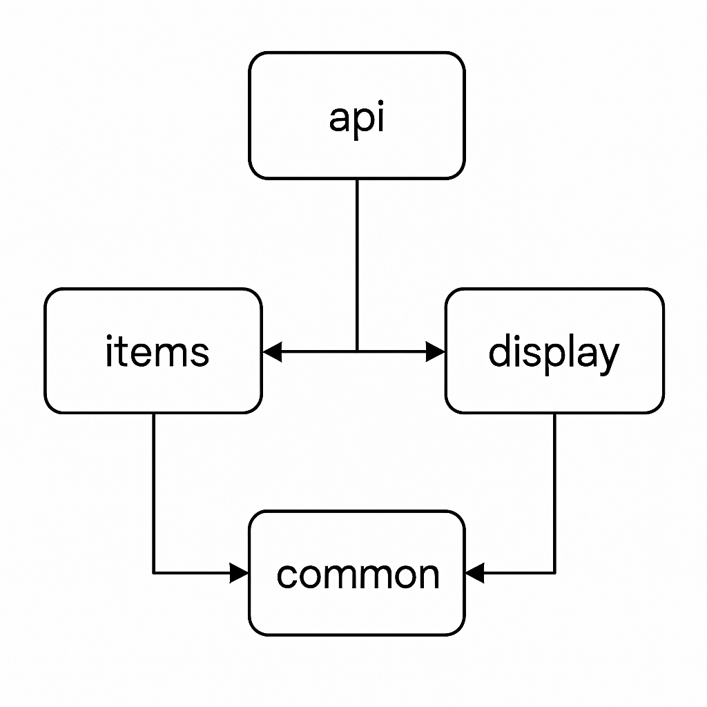

# Financial Planner – Modular API System

A clean, enterprise‑grade, multi‑module Java platform built with **Java 25**,  
**Spring Boot 4.x**, and **Maven**. The system is organized into four  
bounded contexts following Domain‑Driven Design principles:

- **api** – Public interface layer (REST controllers, DTOs, client contracts)
- **items** – Write‑side domain logic and CRUD operations
- **display** – Read‑side projections and view models for UI consumption
- **common** – Shared utilities, exceptions, and cross‑cutting concerns

This project is designed for clarity, modularity, and long‑term maintainability.

---
## 🧱 Project Structure
Each module is packaged as a **JAR** and built under a unified parent POM.

my-system/ ├── api/            
# REST API, controllers, DTOs ├── items/          
# Domain + persistence for source data ├── display/        
# Read models, projections, query handlers ├── common/         
# Shared utilities, exceptions, config └── pom.xml         
# Parent POM (dependency mgmt + modules)

---
## 🧭 Module Responsibilities

### **api**
- Exposes REST endpoints
- Defines DTOs and client‑facing contracts
- Delegates write operations to **items**
- Delegates read operations to **display**

### **items**
- Owns the domain model for “items”
- Handles CRUD operations
- Implements repositories (JPA/R2DBC)
- Contains domain services and aggregates

### **display**
- Provides read‑optimized models
- Query handlers and projections
- Shapes data for UI consumption

### **common**
- Shared utilities
- Custom exceptions
- Reusable config and annotations

---
## 🔗 Dependency Rules
No cross‑context leakage. No circular dependencies.

---
## 🧭 Architecture Overview



## 🚀 Getting Started

### Prerequisites
- Java 25
- Maven 3.9+
- Git

### Build the entire system
To build the entire system, navigate to the project root directory and run:
```bash
mvn clean install
```
This command will compile, test, and package all modules into JAR files.

### Run the API module
To run the API module, navigate to the `api` directory and execute:
```bash
mvn spring-boot:run
```
or directly from the command line:
```bash
mvn -pl api spring-boot:run
```
Or run the packaged JAR:
```bash
java -jar target/api-0.0.1-SNAPSHOT.jar
```
These commands will start the API server on the default port (8000).

---
## 🧪 Running Tests
```bash
mvn test
```
Each module contains its own isolated test suite.

---
## 📦 Packaging

Each bounded context produces a JAR:

```bash
mvn package

```
This command will compile, test, and package each module into a JAR file.
api/target/api-<version>.jar 
items/target/items-<version>.jar 
display/target/display-<version>.jar 
common/target/common-<version>.jar

---
The API module is the only runnable entrypoint.

---

## 🧰 Development Notes

- Use `application-local.yml` for local overrides (ignored by Git)
- Keep domain logic inside the bounded context that owns it
- Avoid placing business logic in controllers
- Use `common` sparingly — only for true cross‑cutting concerns

---

## 📄 License

Internal project — not licensed for external distribution.
