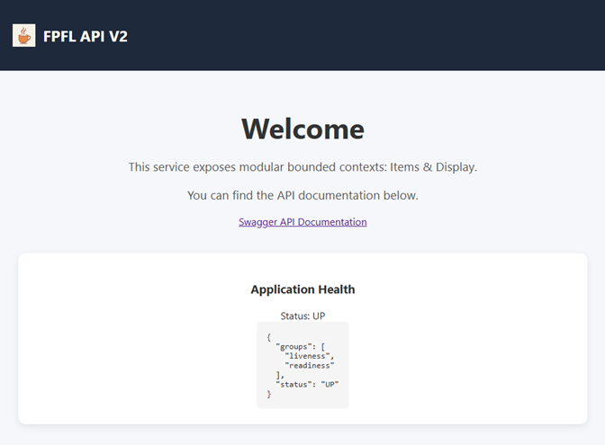
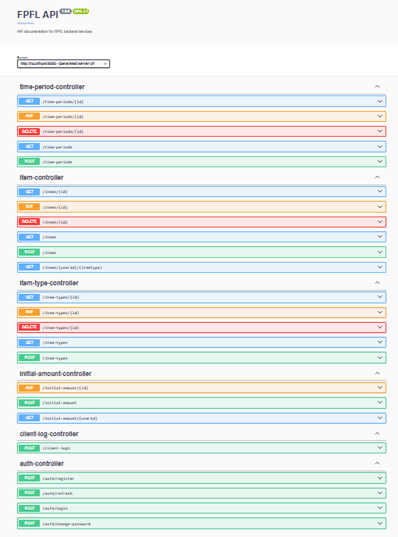
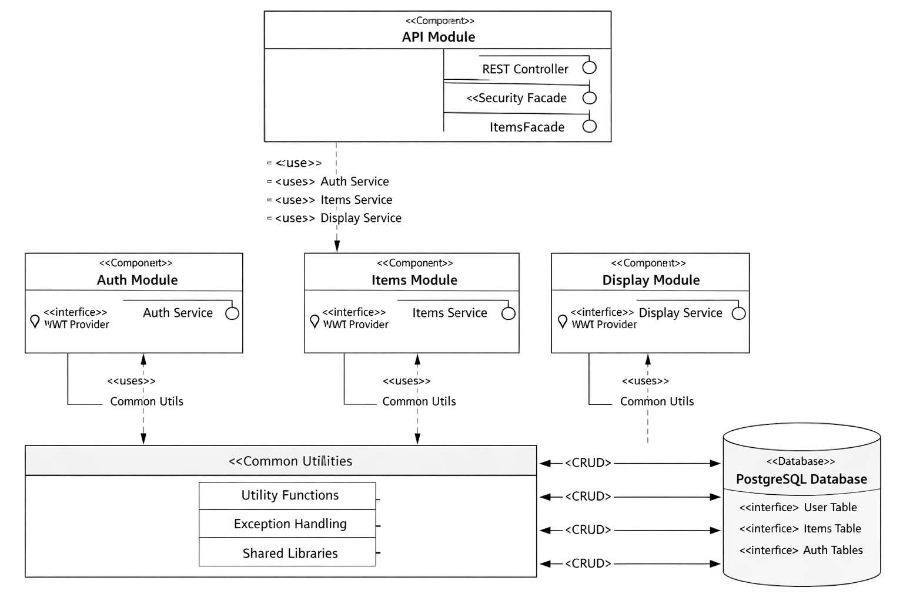
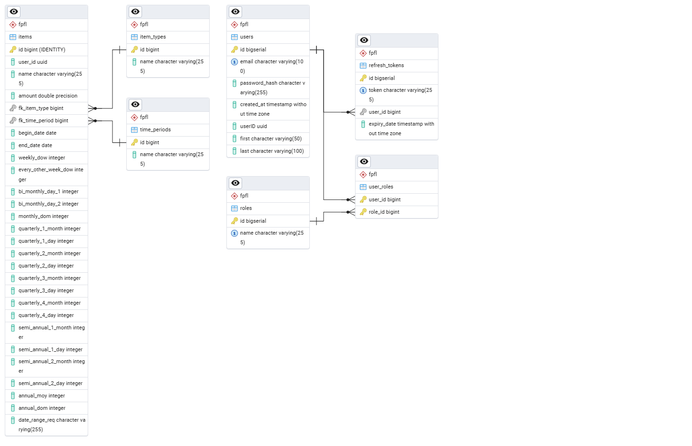

# Financial Planner: Forecast Ledger – Modular API System

A clean, enterprise‑grade, multi‑module Java platform built with **Java 25**,  
**Spring Boot 4.x**, and **Maven**. The system is organized into four  
bounded contexts following Domain‑Driven Design principles:

- **api** – Public interface layer (REST controllers, DTOs, client contracts)
- **items** – Write‑side domain logic and CRUD operations
- **display** – Read‑side projections and view models for UI consumption
- **common** – Shared utilities, exceptions, and cross‑cutting concerns

This project is designed for clarity, modularity, and long‑term maintainability.




---

## 🧱 Project Structure

Each module is packaged as a **JAR** and built under a unified parent POM.

my-system/
 ├── api/            # REST API, controllers, DTOs
 ├── items/          # Domain + persistence for source data
 ├── display/        # Read models, projections, query handlers
 ├── common/         # Shared utilities, exceptions, config
 └── pom.xml         # Parent POM (dependency mgmt + modules)

---

## 🧭 Module Responsibilities

### **api**

- Exposes REST endpoints  
- Defines DTOs and client‑facing contracts  
- Delegates write operations to **items**  
- Delegates read operations to **display**  
- Owns the Spring Boot application, datasource, and JPA configuration  

### **items**

- Owns the domain model for “items”  
- Handles CRUD operations  
- Implements repositories (Spring Data JPA)  
- Contains domain services and aggregates  

### **display**

- Provides read‑optimized models  
- Query handlers and projections  
- Shapes data for UI consumption  

### **common**

- Shared utilities  
- Custom exceptions  
- Reusable config and annotations  

---

## 🔗 Dependency Rules

- No cross‑context leakage  
- No circular dependencies  
- `api` is the only runnable module  
- `items` and `display` depend on `common`  
- `api` depends on all bounded contexts  

---

## 🧭 Architecture Overview



---

# 🗄️ PostgreSQL Database Structure

The API module connects to a PostgreSQL database that stores financial planning items, their types, and their recurrence periods.  
Below is a summary of the schema represented in the ER diagram.

---

## **📌 Tables Overview**

### **items**

Stores all user‑defined financial items, including scheduling metadata.

| Column | Description |
|--------|-------------|
| id | Primary key |
| user_id | Owner of the item |
| name | Item name |
| amount | Monetary value |
| fk_item_type | Foreign key → `item_types.id` |
| fk_time_period | Foreign key → `time_periods.id` |
| begin_date | Start date |
| end_date | End date |
| weekly_dow | Weekly day‑of‑week |
| every_other_week_dow | Bi‑weekly day‑of‑week |
| bi_monthly_day_1 | First bi‑monthly day |
| bi_monthly_day_2 | Second bi‑monthly day |
| monthly_dom | Monthly day‑of‑month |
| quarterly_1_month | Q1 month |
| quarterly_1_day | Q1 day |
| quarterly_2_month | Q2 month |
| quarterly_2_day | Q2 day |
| quarterly_3_month | Q3 month |
| quarterly_3_day | Q3 day |
| quarterly_4_month | Q4 month |
| quarterly_4_day | Q4 day |
| semi_annual_1_month | First semi‑annual month |
| semi_annual_1_day | First semi‑annual day |
| semi_annual_2_month | Second semi‑annual month |
| semi_annual_2_day | Second semi‑annual day |
| annual_moy | Annual month‑of‑year |
| annual_dom | Annual day‑of‑month |
| date_range_req | Whether a date range is required |

---

### **item_types**

Defines the type/category of an item.

| Column | Description |
|--------|-------------|
| id | Primary key |
| name | Type name |

---

### **time_periods**

Defines the recurrence period for an item.

| Column | Description |
|--------|-------------|
| id | Primary key |
| name | Period name |

---

## **🔗 Relationships**

---

item_types (1) ────< (many) items >──── (1) time_periods
---

- `items.fk_item_type` → `item_types.id`
- `items.fk_time_period` → `time_periods.id`



The API module exposes endpoints that operate on these tables through the domain logic in the `items` bounded context.

---

# 🚀 Getting Started

## Prerequisites

- Java 25  
- Maven 3.9+  
- Git  
- PostgreSQL 16+  

Ensure your `application.yml` contains valid datasource credentials.

---

## Build the entire system

---bash
mvn clean install
---

This compiles, tests, and packages all modules into JAR files.

---

## Run the API module

From the `api` directory:

---bash
mvn spring-boot:run
---

Or from the project root:

---bash
mvn -pl api spring-boot:run
---

Or run the packaged JAR:

---bash
java -jar target/api-0.0.1-SNAPSHOT.jar
---

The API starts on port **8000** by default.

---

## 🧪 Running Tests

---bash
mvn test
---

Each module contains its own isolated test suite.

---

## 📦 Packaging

Each bounded context produces a JAR:

---

api/target/api-<version>.jar
items/target/items-<version>.jar
display/target/display-<version>.jar
common/target/common-<version>.jar
---

The **API module is the only runnable entrypoint**.

---

## 🧰 Development Notes

- Use `application-local.yml` for local overrides (ignored by Git)  
- Keep domain logic inside the bounded context that owns it  
- Avoid placing business logic in controllers  
- Use `common` sparingly — only for true cross‑cutting concerns  

---

## 📄 License

This project is licensed under the [MIT License](../LICENSE).

---
---

# 🔒 Patch AssertJ CVE Across Maven Modules

This document outlines the controlled process for identifying, standardizing, and remediating CVE findings related to `org.assertj:assertj-core` across the API‑JDK multi‑module Maven project.

## 📌 Plan Overview
The goal is to baseline current AssertJ CVE findings, align all module versions, apply a patched version centrally, and verify the fix through CVE validation and a full reactor build.

## 🧭 Steps

### 1. Capture Baseline CVE Findings
Run:

```
validate_cves_for_java
```

Record all findings related to:

```
org.assertj:assertj-core
```

This establishes the before‑state for comparison.

---

### 2. Locate All AssertJ Declarations
Inspect the following module POMs:

- `module-common-bc/pom.xml`
- `module-display-bc/pom.xml`
- `module-items-bc/pom.xml`

Identify:
- Direct `assertj-core` declarations  
- Any inherited versions coming from `dependencyManagement`

---

### 3. Confirm Effective Versions
Use:

```
mvn help:effective-pom
```

Verify:
- Which modules inherit the parent version  
- Which modules override it  
- Whether any transitive dependencies introduce older AssertJ versions

---

### 4. Standardize the AssertJ Version
Choose a single patched version and apply it consistently.

**Preferred approach:**  
✔ Add the version once in the root `dependencyManagement`  
✔ Remove module‑level overrides

This ensures:
- Version consistency  
- Easier future upgrades  
- Cleaner module POMs

---

### 5. Re‑Run CVE Validation
Run:

```
validate_cves_for_java
```

Compare before/after results to confirm the AssertJ CVE is resolved.

---

### 6. Verify Build & Test Stability
Execute a full reactor build from the project root:

```
mvn clean verify
```

Confirm:
- All modules compile  
- Tests pass  
- No regressions introduced by the dependency update

---

## 🧩 Further Considerations

### ✔ Which patched version should we target?
Options include:
- **Latest stable AssertJ release**  
- **Version aligned with Spring Boot BOM**  
- **Security‑team mandated minimum version**

### ✔ Where should the version be controlled?
- **Option A (recommended):** Centralize in parent `dependencyManagement`  
- **Option B:** Explicitly pin per module (only if module isolation is required)

### ✔ What if the CVE persists transitively?
Evaluate:
- Adding exclusions  
- Upgrading the Spring BOM  
- Upgrading the parent dependency strategy

