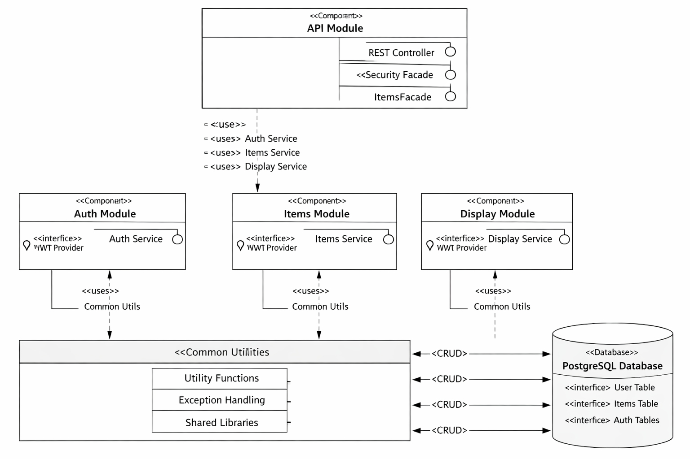
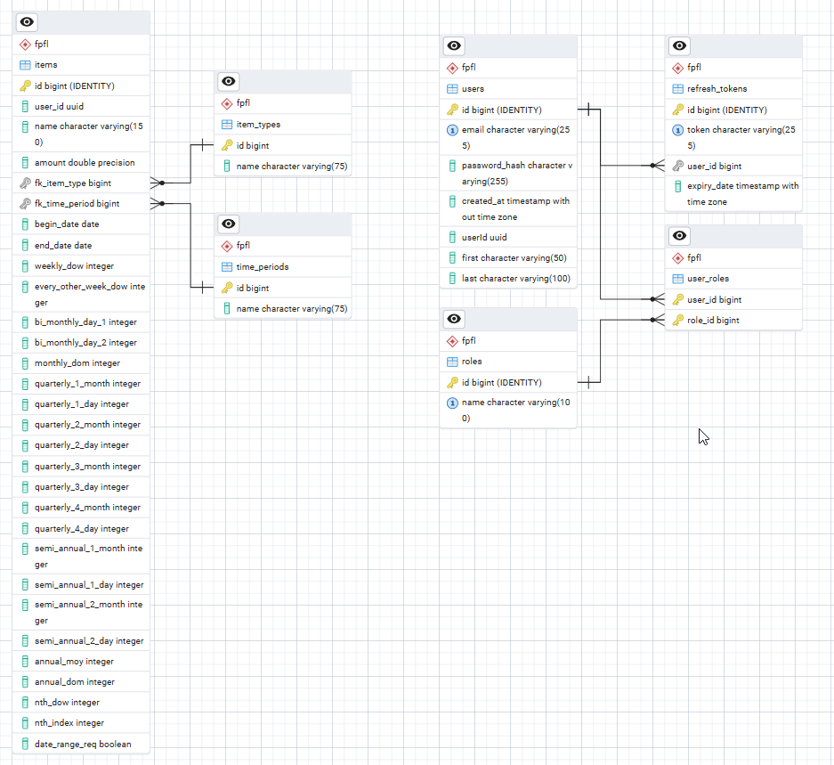
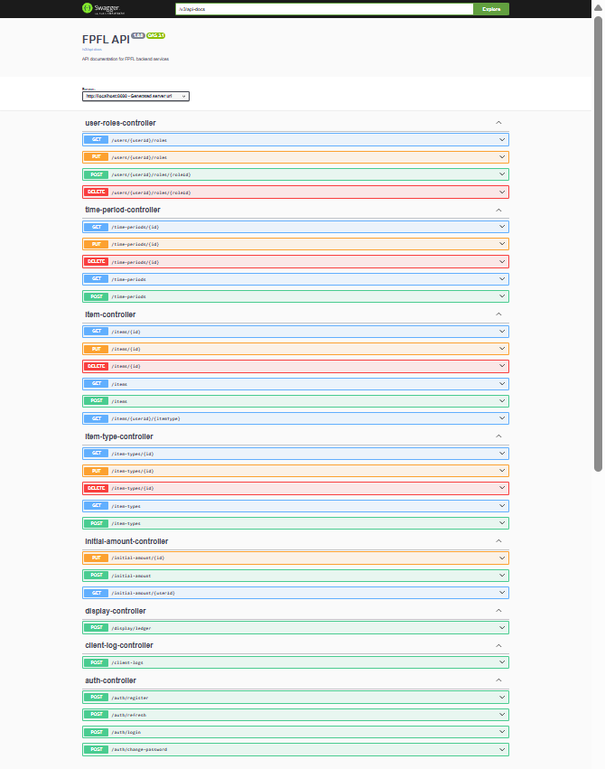

# Financial Planner: Forecast Ledger — API JDK

[](https://github.com/rdonalson/FPFL-React-Java/actions)
[](https://openjdk.org/projects/jdk/25/)
[](https://spring.io/projects/spring-boot)
[](../LICENSE)

A clean, enterprise‑grade, multi‑module Java platform built with **Java 25**, **Spring Boot 4.0.x**, and **Maven**. The system follows Domain‑Driven Design and is organized into bounded contexts for clarity, testability, and long‑term maintainability.

---

## Overview

**Purpose**
Provide a modular backend API that stores, manages, and projects user financial planning items (recurring payments, incomes, and scheduled events). The **module-api** module exposes REST endpoints and is the single runnable entrypoint; authentication, domain logic, projections, and persistence live in separate bounded contexts.

**Key technologies**
Java 25 · Spring Boot 4.0.6 · Spring Security · Spring Data JPA · springdoc‑openapi · JJWT · Lombok · Maven · PostgreSQL 16+

**Deployed as**
A multi‑stage Docker image (`fpflapijdkimg`) pushed to Azure Container Registry and rolled out to AKS by GitHub Actions. Live at <https://api-jdk.ledger-finance.com>.

---

## Quick links

- **Runnable module**: `module-api/` (Spring Boot app, the only executable JAR)
- **Docs**: [`docs/`](docs) — architecture and ER diagrams, screenshots, [troubleshooting](docs/TROUBLESHOOTING.md), [security reports](docs/security)
- **CI/CD workflow**: [`../.github/workflows/build-push-api.yml`](../.github/workflows/build-push-api.yml)
- **Kubernetes manifests**: [`../k8s/API`](../k8s/API)
- **License**: [`../LICENSE`](../LICENSE) (MIT)

---

## Project structure

Each module is packaged as a **JAR** and built under a unified parent POM (`com.Financial-Planner:FPFL-V2-Microservice:1.0.0`).

```
API-JDK/
 ├── module-api/          # REST API, controllers, DTOs, security filters, app bootstrap
 ├── module-auth/         # Authentication and authorization domain
 ├── module-items-bc/     # Write-side domain + persistence for financial items
 ├── module-display-bc/   # Read models, recurrence expansion, ledger projections
 ├── module-common-bc/    # Shared utilities, exceptions, sanitization, converters
 ├── docs/                # Diagrams, screenshots, troubleshooting, security reports
 ├── Dockerfile           # Multi-stage build (Maven + Temurin 25 → JRE 25)
 ├── docker-compose.yml   # Local container run
 └── pom.xml              # Parent POM (dependencyManagement + modules)
```

Reactor build order: `module-common-bc` → `module-items-bc` → `module-display-bc` → `module-auth` → `module-api`.

---

## Module responsibilities

### **module-api**

- Exposes REST endpoints and OpenAPI/Swagger contracts (`springdoc-openapi`)
- Defines DTOs, mappers, and the `ApiResponse` envelope for client‑facing contracts
- Owns the Spring Security filter chain, JWT validation (`JwtAuthFilter`, `JwtServiceImpl`), and `CustomUserDetails`
- Delegates write operations to **module-items-bc** and read operations to **module-display-bc**
- Owns Spring Boot application bootstrap, datasource, JPA, and Actuator configuration
- Centralizes error translation in `GlobalExceptionHandler`

**Controllers:** `AuthController`, `UserRolesController`, `ItemController`, `ItemTypeController`, `TimePeriodController`, `InitialAmountController`, `DisplayController`, `ClientLogController`

### **module-auth**

- Centralized authentication and authorization domain
- Users, roles, user‑role assignments, and persisted refresh tokens
- JWT signing/parsing via **JJWT**; password hashing via `PasswordEncoderConfig` (`spring-security-crypto`)
- Token lifetimes configured through `TokenProperties`
- Keeps security *domain* logic out of `module-api`, which owns only the filter chain

### **module-items-bc**

- Owns the write‑side domain model for financial items
- Handles CRUD operations and domain invariants for `Item`, `ItemType`, and `TimePeriod`
- Implements repositories through a ports‑and‑adapters split: domain `*Repository` interfaces, `*RepositoryImpl` adapters, and Spring Data `Jpa*Repository` interfaces (plus `JpaItemRepositoryCustom` for hand‑written queries)

### **module-display-bc**

- Provides read‑optimized models and projections shaped for UI consumption
- Expands each item's recurrence metadata into concrete dated occurrences — one expander per pattern (one‑time, daily, weekly, bi‑weekly, monthly, bi‑monthly, quarterly, semi‑annual, annual, nth‑weekday)
- `LedgerReadoutService` composes occurrences with the user's initial amount into a running‑balance ledger
- Depends on `module-items-bc` for the item model; keeps read concerns separate from write models

### **module-common-bc**

- Shared exceptions (`DomainException`, `DomainValidationException`, `ItemNotFoundException`, `DuplicateItemException`, `RepositoryException`, `SanitizationException`, `InvalidCredentialsException`, `ForbiddenOperationException`)
- Input sanitization (`SanitizerImpl` with `@StrictText`, `@LenientText`, `@NoSanitize` annotations)
- `ErrorLogger` and JPA converters (`BooleanToBitConverter`)
- Use sparingly — only for true cross‑cutting concerns

---

## Dependency rules

- No cross‑context leakage: domain logic must remain in its owning bounded context.
- No circular dependencies.
- `module-api` is the only runnable module and the only one with the Spring Boot repackage plugin.
- `module-auth`, `module-items-bc`, and `module-common-bc` are Spring‑agnostic apart from Spring Data JPA — no web layer.
- Actual dependency edges:

```
module-api  ──► module-auth ──► module-common-bc
     │                              ▲
     ├──────► module-display-bc ────┤
     │              │               │
     │              ▼               │
     └──────► module-items-bc ──────┘
```

---

## 🧭 Architecture Overview



---

# 🗄️ PostgreSQL Database Structure

The API module connects to a PostgreSQL database that stores financial planning items, their types, their recurrence periods, and the authentication tables backing `module-auth`.
Below is a summary of the schema represented in the ER diagram.

Schema management runs through Hibernate (`ddl-auto: update`) against the configured default schema.

---

## **📌 Tables Overview**

### **items**

Stores all user‑defined financial items, including scheduling metadata. The recurrence columns are mutually exclusive — only the set matching the item's `fk_time_period` is populated, and `module-display-bc` reads exactly that set when expanding occurrences.

| **Column**               | **Description**                                             |
| ------------------------ | ----------------------------------------------------------- |
| **id**                   | Primary key                                                 |
| **user_id**              | Owner of the item (UUID referencing `users.userID`)         |
| **name**                 | Item name                                                   |
| **amount**               | Monetary value                                              |
| **fk_item_type**         | Foreign key → `item_types.id`                               |
| **fk_time_period**       | Foreign key → `time_periods.id`                             |
| **begin_date**           | Start date                                                  |
| **end_date**             | End date                                                    |
| **weekly_dow**           | Weekly day of week (0–6 or 1–7 depending on app convention) |
| **every_other_week_dow** | Bi‑weekly day of week                                       |
| **bi_monthly_day_1**     | First bi‑monthly day                                        |
| **bi_monthly_day_2**     | Second bi‑monthly day                                       |
| **monthly_dom**          | Monthly day of month                                        |
| **quarterly_1_month**    | Q1 month                                                    |
| **quarterly_1_day**      | Q1 day                                                      |
| **quarterly_2_month**    | Q2 month                                                    |
| **quarterly_2_day**      | Q2 day                                                      |
| **quarterly_3_month**    | Q3 month                                                    |
| **quarterly_3_day**      | Q3 day                                                      |
| **quarterly_4_month**    | Q4 month                                                    |
| **quarterly_4_day**      | Q4 day                                                      |
| **semi_annual_1_month**  | First semi‑annual month                                     |
| **semi_annual_1_day**    | First semi‑annual day                                       |
| **semi_annual_2_month**  | Second semi‑annual month                                    |
| **semi_annual_2_day**    | Second semi‑annual day                                      |
| **annual_moy**           | Annual month of year                                        |
| **annual_dom**           | Annual day of month                                         |
| **date_range_req**       | Whether a date range is required (flag or descriptor)       |

---

### **item_types**

Defines the type/category of an item — the credit/debit classification applied to the ledger.

| **Column** | **Description**                              |
| ---------- | -------------------------------------------- |
| **id**     | Primary key                                  |
| **name**   | Type name (e.g., rent, salary, subscription) |

---

### **time_periods**

Defines the recurrence period for an item. The chosen period determines which recurrence columns on `items` are used.

| **Column** | **Description**                                                        |
| ---------- | ---------------------------------------------------------------------- |
| **id**     | Primary key                                                            |
| **name**   | Period name (e.g., one‑time, daily, weekly, monthly, quarterly, annual) |

---

### **users**

Stores application user accounts used by the auth module and referenced by items.

| **Column**        | **Description**                                         |
| ----------------- | ------------------------------------------------------- |
| **id**            | Primary key (bigserial) used for relational joins       |
| **userID**        | Application UUID for the user (used as `items.user_id`) |
| **email**         | Unique username or email address                        |
| **password_hash** | Hashed password (store only salted hashes)              |
| **first**         | First name                                              |
| **last**          | Last name                                               |
| **created_at**    | Account creation timestamp                              |
| **last_login**    | Last successful login timestamp                         |

---

### **roles**

Defines named roles for authorization.

| **Column** | **Description**                         |
| ---------- | --------------------------------------- |
| **id**     | Primary key (bigserial)                 |
| **name**   | Role name (e.g., ROLE_USER, ROLE_ADMIN) |

---

### **user_roles**

Join table mapping users to roles. Mapped in `module-auth` by `UserRoles` with the composite key `UserRolesId`.

| **Column**  | **Description**                          |
| ----------- | ---------------------------------------- |
| **user_id** | FK → `users.id` (links a user to a role) |
| **role_id** | FK → `roles.id` (links a role to a user) |

---

### **refresh_tokens**

Tracks refresh tokens for session management and revocation.

| **Column**      | **Description**                                                            |
| --------------- | -------------------------------------------------------------------------- |
| **id**          | Primary key (bigserial)                                                    |
| **token**       | Stored token value or token identifier (store hashed token where possible) |
| **user_id**     | FK → `users.id` (owner of the token)                                       |
| **expiry_date** | Token expiration timestamp                                                 |
| **revoked**     | Optional boolean flag indicating token revocation (if implemented)         |

---

## **🔗 Relationships**

### item_types (1) ────< (many) items >──── (1) time_periods

- `items.fk_item_type` → `item_types.id`
- `items.fk_time_period` → `time_periods.id`
- `items.user_id` → `users.userID` (user ownership; userID is UUID)

### users (1) ────< (many) user_roles >──── (1) roles

- `user_roles.user_id` → `users.id`
- `user_roles.role_id` → `roles.id`

### users (1) ────< (many) refresh_tokens

- `refresh_tokens.user_id` → `users.id`

---



The API module exposes endpoints that operate on these tables through the domain logic in the `module-items-bc` and `module-auth` bounded contexts.

---

## 🚀 Getting Started

### Prerequisites

- Java 25
- Maven 3.9+
- Git
- PostgreSQL 16+
- Docker (optional, for containerized runs)

### Configuration

Runtime configuration lives in [`module-api/src/main/resources/application.yaml`](module-api/src/main/resources/application.yaml), which reads its datasource values from environment variables. **spring-dotenv** loads them from a `.env` file at the `API-JDK` root, so local setup is a matter of creating one:

```dotenv
DB_URL=jdbc:postgresql://localhost:5432/FPFL-V2
DB_USERNAME=postgres
DB_PASSWORD=your-password
```

| File | Used by |
| ---- | ------- |
| `.env` | Local development |
| `.env.docker` | Local Docker Compose runs |
| `.env.prod` | Production‑shaped container runs |

All three are Git‑ignored. In AKS the same three values come from the `api-db-secret` Kubernetes secret instead.

**Other settings** (`application.yaml`):

| Setting | Value |
| ------- | ----- |
| `spring.jpa.hibernate.ddl-auto` | `update` |
| Hibernate dialect | `PostgreSQLDialect` |
| Actuator endpoints exposed | `health`, `info` (with full details and components) |
| `security.jwt.access-token-expiration-ms` | `900000` (15 minutes) |
| `security.jwt.refresh-token-expiration-ms` | `900000` (15 minutes) |

> ⚠️ `security.jwt.secret` ships with a placeholder value. Override it with a real 256‑bit secret via environment variable before any non‑local deployment.

---

## Build the entire system

From the `API-JDK` directory:

```bash
mvn clean install
```

This compiles, tests, and packages all five modules into JARs.

---

## Run the API module

From the `API-JDK` root:

```bash
mvn -pl module-api spring-boot:run
```

Or from the `module-api` directory:

```bash
mvn spring-boot:run
```

Or run the packaged JAR:

```bash
java -jar module-api/target/module-api-1.0.0.jar
```

The API starts on port **8080** (Spring's default — no `server.port` override is set; the Docker and Kubernetes runtimes pass `SERVER_PORT=8080` explicitly).

| Endpoint | URL |
| -------- | --- |
| Welcome page | <http://localhost:8080/> |
| Swagger UI | <http://localhost:8080/swagger-ui.html> |
| Actuator health | <http://localhost:8080/actuator/health> |



---

## 🐳 Docker

The [`Dockerfile`](Dockerfile) is a two‑stage build: `maven:3.9.11-eclipse-temurin-25` copies the parent and module POMs first so `dependency:go-offline` caches cleanly, builds the fat JAR, then `eclipse-temurin:25-jre` runs it. The runtime image exposes **8080**.

```bash
docker compose up --build
```

`docker-compose.yml` reads `.env.prod` and maps `8080:8080`.

---

## 🔄 CI/CD

Pushes to `main` that touch `API-JDK/**` or `k8s/API/*.yaml` trigger [`build-push-api.yml`](../.github/workflows/build-push-api.yml):

1. Build and push `fpflacr.azurecr.io/fpflapijdkimg` tagged `:${{ github.sha }}` and `:latest`, with GitHub Actions layer caching for the Maven stage
2. Azure login → set AKS context (`fpfl-cluster`) → `kubectl apply` the service, deployment, and ingress
3. `kubectl rollout restart deployment/api -n fpfl` and wait for `rollout status`

Full pipeline details are in the [root README](../README.md#-cicd-pipeline).

---

## 🧪 Running Tests

```bash
mvn test
```

Each module contains its own isolated test suite. The bounded contexts test with **JUnit Jupiter** and **Mockito**; `module-api` additionally pulls Spring Boot 4's modular test starters (`spring-boot-starter-webmvc-test`, `-data-jpa-test`, `-validation-test`, `-actuator-test`).

---

## 📦 Packaging

Each module produces a JAR under its own `target/`:

- `module-api/target/module-api-1.0.0.jar` — **the only runnable entrypoint** (Spring Boot fat JAR)
- `module-auth/target/module-auth-1.0.0.jar`
- `module-items-bc/target/module-items-bc-1.0.0.jar`
- `module-display-bc/target/module-display-bc-1.0.0.jar`
- `module-common-bc/target/module-common-bc-1.0.0.jar`

---

## 🔒 Security & Dependency Management

- Dependency versions are pinned centrally in the parent POM's `dependencyManagement` — modules declare artifacts without versions so upgrades happen in one place.
- CVE findings, remediations, and triaged false positives are tracked under [`docs/security/`](docs/security):
  - [CVE-VALIDATION-REPORT.md](docs/security/CVE-VALIDATION-REPORT.md)
  - [VULNERABILITY-FIX-SUMMARY.md](docs/security/VULNERABILITY-FIX-SUMMARY.md)
  - [assertj-cve-remediation.md](docs/security/assertj-cve-remediation.md) — the AssertJ standardization runbook
  - [false-positives/](docs/security/false-positives)

---

## 🧰 Development Notes

- Keep domain logic inside the bounded context that owns it
- Avoid placing business logic in controllers — they delegate to services and map through DTOs
- Use `module-common-bc` sparingly — only for true cross‑cutting concerns
- Sanitize user‑supplied strings with the `@StrictText` / `@LenientText` annotations rather than ad‑hoc cleanup
- Never commit `.env` files or a real JWT secret
- See [docs/TROUBLESHOOTING.md](docs/TROUBLESHOOTING.md) for common local setup problems

---

## 📄 License

This project is licensed under the [MIT License](../LICENSE).
