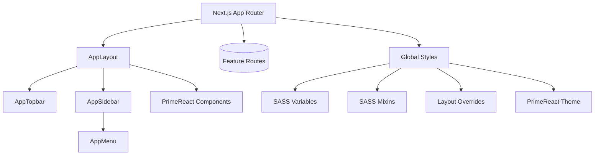

# UI-JSX-SAKAI

UI-JSX-SAKAI is a modern Next.js 13+ web application integrating PrimeReact, the Sakai layout system, and a fully customizable SASS design system. It provides a clean, enterprise-ready foundation for scalable UI development, consistent theming, and maintainable architecture.

---

## Badges

`https://img.shields.io/badge/Next.js-13+-black`
`https://img.shields.io/badge/React-18-blue`
`https://img.shields.io/badge/TypeScript-5-blue`
`https://img.shields.io/badge/PrimeReact-10-green`
`https://img.shields.io/badge/SASS-SCSS-pink`
`https://img.shields.io/badge/License-MIT-yellow`

---

## Overview

This project includes:

- Next.js App Router architecture  
- React with TypeScript  
- PrimeReact components and PrimeIcons  
- Sakai layout integration (topbar, sidebar, menu model)  
- SASS-based design system with variables, mixins, and layout overrides  
- Enterprise folder structure optimized for onboarding and long-term maintainability  

---

## Architecture Diagram



---

## Project Structure

```
ui-jsx-sakai/
│
├── app/
│   ├── layout.tsx              # Root layout mapping Sakai → Next.js
│   ├── page.tsx                # Home page
│   ├── (app)/                  # Feature routes
│   └── globals.scss            # Global SASS entrypoint
│
├── components/
│   ├── layout/
│   │   ├── AppLayout.tsx       # Main Sakai layout container
│   │   ├── AppTopbar.tsx       # Header bar
│   │   ├── AppSidebar.tsx      # Sidebar + overlay logic
│   │   └── AppMenu.tsx         # Menu model + rendering
│   │
│   └── ui/                     # Reusable UI components
│
├── styles/
│   ├── _variables.scss         # Theme variables + Sakai overrides
│   ├── _mixins.scss            # Shared mixins
│   ├── _layout.scss            # Layout-specific overrides
│   └── theme.scss              # Compiled theme entrypoint
│
├── public/
│   └── layout/                 # Sakai static assets (logos, images)
│
├── primereact-theme/           # Optional: custom compiled theme output
│
├── package.json
└── tsconfig.json
```

---

## Theming and SASS

The SASS pipeline provides:

- Centralized variables for colors, spacing, and typography  
- Clean overrides for Sakai layout classes  
- A maintainable structure for PrimeReact component theming  
- A single `theme.scss` entrypoint for compiling a custom theme  

This ensures consistent styling across the entire UI and avoids scattered CSS overrides.

---

## Sakai Layout Integration

The Sakai layout is implemented using modular components:

- `AppLayout` – root application shell  
- `AppTopbar` – header bar  
- `AppSidebar` – responsive sidebar with overlay mode  
- `AppMenu` – typed menu model and renderer  

Features include:

- Responsive sidebar  
- Overlay slide-in/out animation  
- Configurable menu model  
- Clean separation of layout and feature code  

---

## Development

### Install dependencies

```bash
npm install
```

### Run the development server

```bash
npm run dev
```

### Build for production

```bash
npm run build
```

### Start the production server

```bash
npm start
```

---

## Tech Stack

- Next.js 13+ (App Router)  
- React 18 + TypeScript  
- PrimeReact + PrimeIcons  
- Sakai Layout System  
- SASS (SCSS)  
- ESLint + Prettier  

---

## Features

- Enterprise-grade folder structure  
- Fully integrated Sakai layout  
- Custom SASS design system  
- Typed, modular menu model  
- Clean separation of layout and feature code  
- Ready for Docker, CI/CD, and multi-environment configuration  

---

## Roadmap

- Add reusable form components  
- Expand theme tokens (dark/light modes)  
- Add logging and error boundaries  
- Add example feature modules (Dashboard, Settings, etc.)  
- Document environment-driven configuration for API endpoints  

---

## License

MIT License. Free to use, modify, and distribute.

---

If you want, I can also format this into a **GitHub‑optimized version with a table of contents**, or help you add **status badges**, **screenshots**, or **demo GIFs**.
