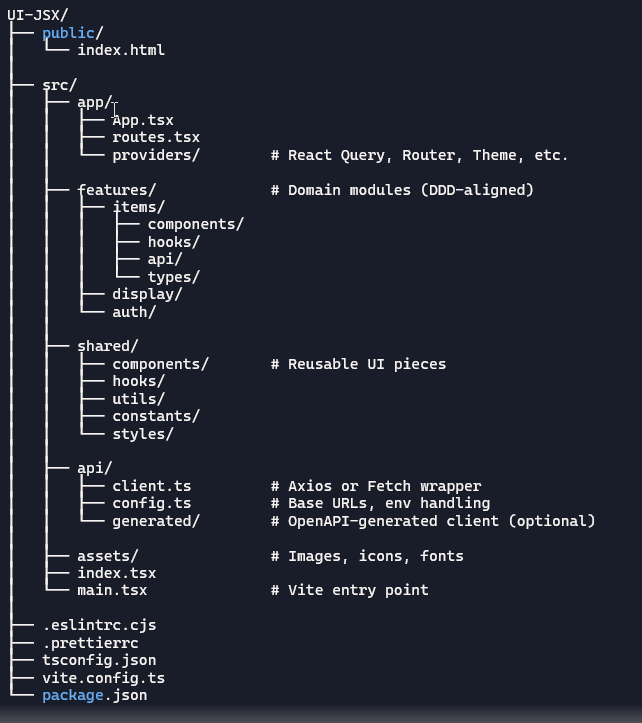

# UI-JSX — React Frontend for FPFL-React-Java

This is the React + TypeScript frontend for the FPFL full‑stack system.  
It communicates with the Java 25 / Spring Boot 4 API and provides a clean, modular UI.

---

## 🚀 Tech Stack

- React 18
- TypeScript
- Vite
- React Query (TanStack Query)
- React Router
- Axios (with interceptors)
- ESLint + Prettier (strict mode)

---

## 📁 Project Structure



The structure mirrors the backend’s bounded contexts for clarity and onboarding.

---

## 🔌 API Client

All HTTP requests go through `src/api/client.ts`, which provides:

- Base URL handling
- JSON headers
- Correlation IDs
- Normalized error responses

Domain modules never talk to Axios directly.

---

## 📦 Features

Each domain lives in:
src/features/<domain>/ api/ hooks/ types/ components/

This keeps the UI modular, scalable, and easy to onboard.

---

## 🧪 Running the App

```bash
npm install
npm run dev
```
