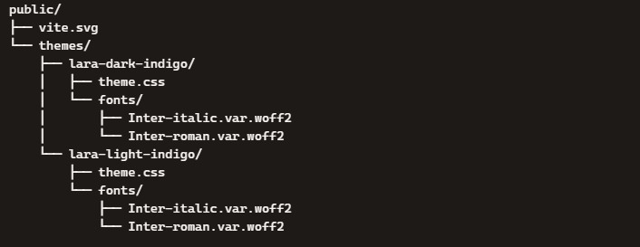
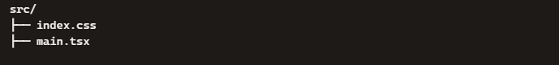
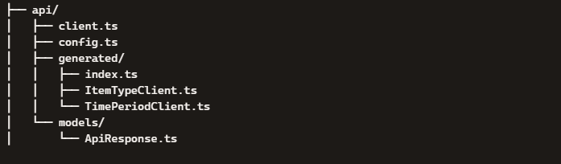
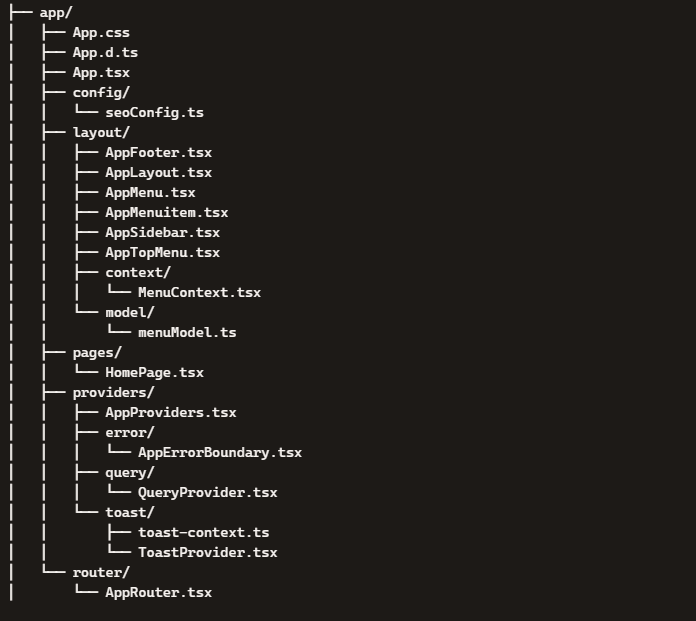
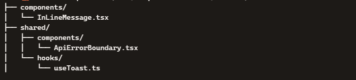
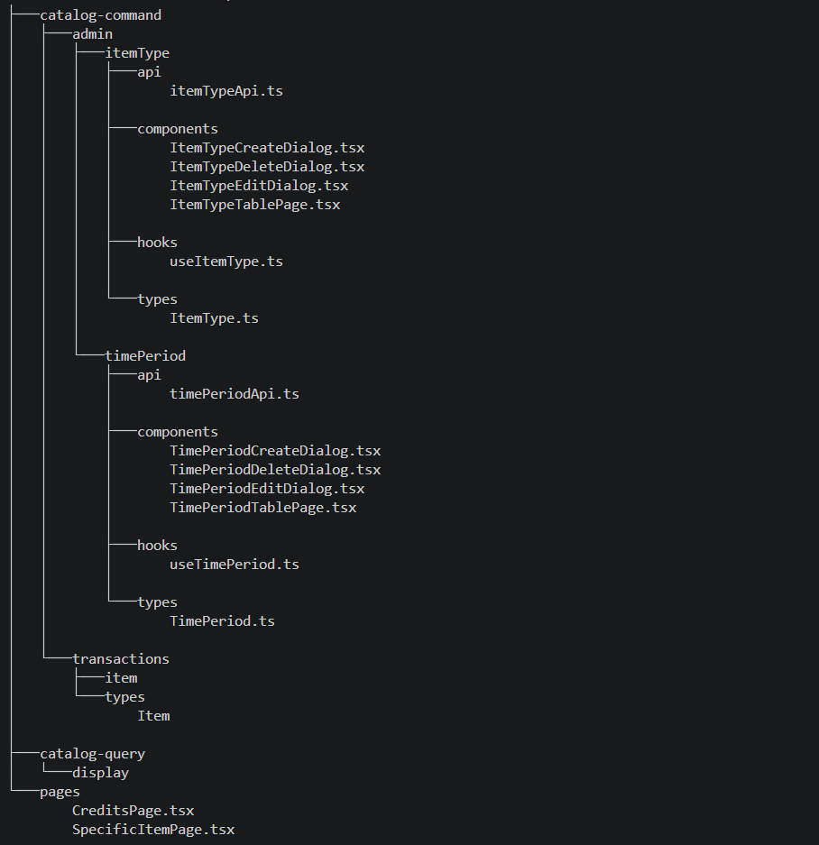

# UI-JSX — React Frontend for FPFL-React-Java

UI-JSX is the React + TypeScript frontend for the FPFL platform.  
It is built with Vite, follows a modular domain‑driven structure, and integrates cleanly with the Java 25 / Spring Boot 4 API.

---

## 🚀 Tech Stack

- **React 18**  
- **TypeScript**
- **Vite**
- **React Query (TanStack Query)** for async state + caching
- **React Router** for routing
- **Axios** with centralized interceptors
- **Components** PrimeReact / PrimeFlex / PrimeIcons
- **ESLint + Prettier** (strict formatting + linting)

---

## 📁 Project Structure

The folder layout mirrors backend bounded contexts to keep the system consistent, modular, and easy to onboard.

### High‑level layout


### 🟦 public/



### 🟩 src/



### 🔌 API Layer (`src/api`)



### 🧩 Application Layer (`src/app`)



### 🧱 Shared Components (`src/components` + `src/shared`)



### 🟨 Feature Modules (`src/features`)



---

## 🔌 API Client

All HTTP requests go through `src/api/client.ts`, which provides:

- Base URL + environment handling  
- JSON headers  
- Correlation IDs  
- Normalized error responses  
- Centralized request/response interceptors  

Domain modules **never** call Axios directly.

---

## 📦 Features

Each domain module encapsulates:

- API functions  
- React Query hooks  
- UI components  
- Type definitions  

This ensures strong separation of concerns and predictable growth as new features are added.

---

## 🧪 Running the App

```bash
npm install
npm run dev

