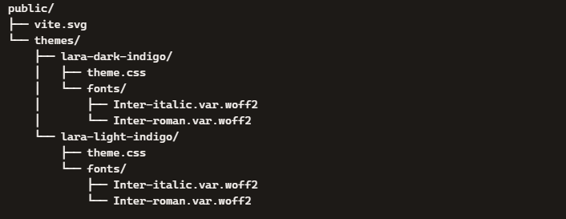
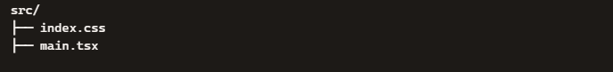
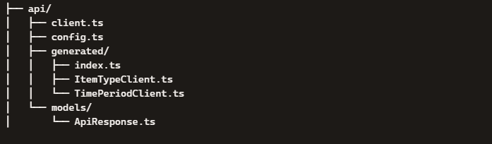
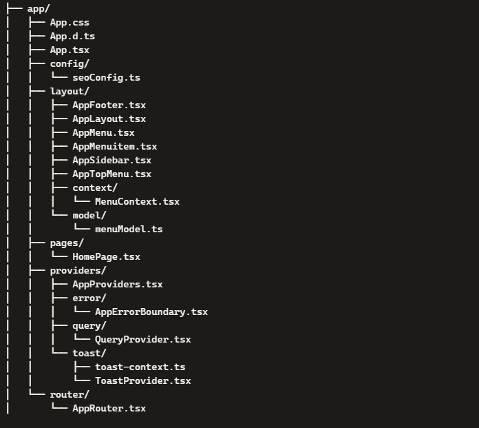
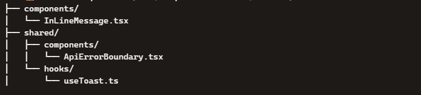
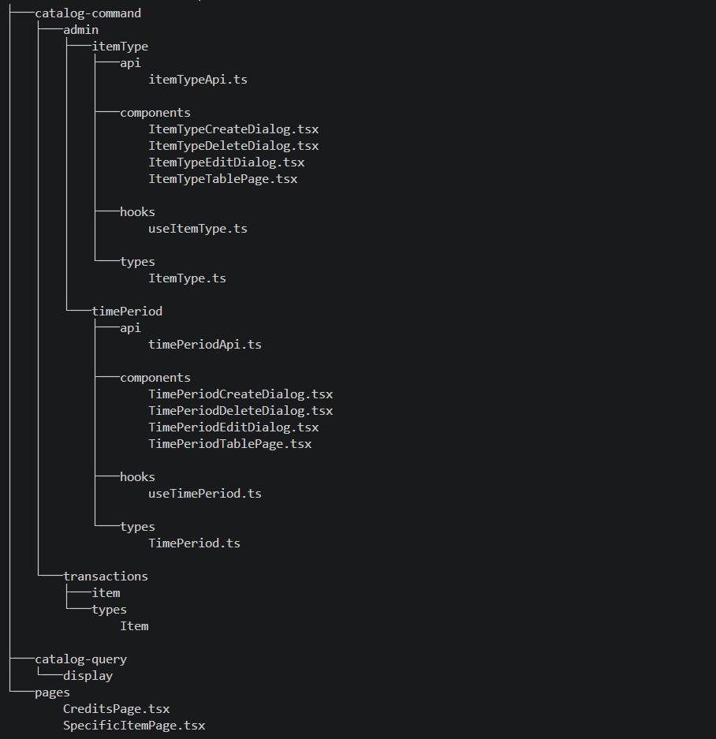

# UI-TSX — React Frontend for FPFL-React-Java

UI-TSX is the React + TypeScript frontend for the FPFL platform.
It is built with Vite, follows a modular domain-driven structure, and integrates cleanly with the Java 25 / Spring Boot 4 API.

Live at <https://ui-tsx.ledger-finance.com> · API at <https://api-jdk.ledger-finance.com>

---

## 🚀 Tech Stack

| Area | Choice |
| ---- | ------ |
| **Framework** | React 19 + TypeScript, compiled by the **React Compiler** (`babel-plugin-react-compiler`) |
| **Build tool** | Vite 7 (`@vitejs/plugin-react`, `vite-plugin-checker` for in-dev type/lint errors) |
| **UI components** | PrimeReact 10 · PrimeFlex · PrimeIcons, with Radix primitives (dialog, dropdown, popover, tabs, tooltip) and `lucide-react` icons |
| **Styling** | Tailwind CSS + `tailwindcss-primeui` · SCSS (`sass-embedded`) for global styles and PrimeReact overrides |
| **Server state** | TanStack Query (async state + caching) |
| **Tables** | TanStack Table |
| **Client state** | Zustand (session + theme stores) |
| **Routing** | React Router 7 |
| **Forms** | React Hook Form + Zod (via `@hookform/resolvers`) |
| **HTTP** | Axios with centralized interceptors |
| **Charting** | Chart.js |
| **Auth** | JWT with `jwt-decode`, refresh-token rotation, idle/expiry watcher |
| **Misc** | `react-helmet-async` (SEO/meta) · `react-hot-toast` (notifications) |
| **Tooling** | ESLint 9 (flat config) + Prettier — strict formatting + linting |

---

## 📁 Project Structure

The folder layout mirrors backend bounded contexts to keep the system consistent, modular, and easy to onboard.

```
UI-TSX/
 ├── public/                  # Static assets, optional runtime config.json
 ├── src/
 │    ├── api/                # Axios client, generated API clients, health checks, helpers
 │    ├── app/                # App shell: layout, routing, auth, providers, state
 │    ├── components/         # Small standalone components
 │    ├── config/             # appConfig — merged build-time + runtime configuration
 │    ├── features/           # Domain feature modules (command / query split)
 │    ├── shared/             # Cross-feature components, hooks, utils
 │    ├── styles/             # SCSS partials and main.scss
 │    ├── bootstrap.ts        # Runtime config loader
 │    ├── main.tsx            # Entry point — bootstraps config, then renders
 │    └── index.css           # Tailwind entry
 ├── Dockerfile               # Multi-stage build → static preview server
 ├── docker-compose.yml       # UAT-flavored container run
 ├── docker-compose.prod.yml  # Production-flavored container run
 ├── vite.config.ts
 └── package.json
```

### High-level layout


### 🟦 public/



### 🟩 src/



### 🔌 API Layer (`src/api`)



### 🧩 Application Layer (`src/app`)



### 🧱 Shared Components (`src/components` + `src/shared`)



### 🟨 Feature Modules (`src/features`)



---

## ⚙️ Configuration

Configuration resolves in two layers, merged by [`src/config/appConfig.ts`](src/config/appConfig.ts):

1. **Build-time defaults** — `import.meta.env.VITE_*`, baked in by Vite at build time
2. **Runtime overrides** — loaded at startup by [`src/bootstrap.ts`](src/bootstrap.ts) from a server-injected `window.__RUNTIME_CONFIG__`, falling back to a fetch of `/config.json` (2-second timeout, then build-time defaults)

`main.tsx` awaits `initAppConfig()` before the first render, so `AppConfig.get()` is always populated by the time components mount.

### Environment files

| File | Used by |
| ---- | ------- |
| `.env.development` | `npm run dev` — API at `http://localhost:8080`, session debug on |
| `.env.uat` | UAT container runs |
| `.env.prod` | Production builds — API at `https://api-jdk.ledger-finance.com` |

### Recognized variables

| Variable | Default | Purpose |
| -------- | ------- | ------- |
| `VITE_API_URL` | `http://localhost:8080` | API base URL |
| `VITE_API_TIMEOUT_MS` | `10000` | Axios timeout |
| `VITE_NODE_ENV` | `development` | Environment label sent with client error logs |
| `VITE_SESSION_WARNING_MS` | `300000` | How long before token expiry to warn the user |
| `VITE_SESSION_GRACE_PERIOD_MS` | `0` | Grace period after expiry |
| `VITE_SESSION_DEBUG` | `false` | Logs every request/response to the console |
| `VITE_APP_TITLE` / `VITE_APP_DESCRIPTION` / `VITE_APP_OG_IMAGE` | see `appConfig.ts` | App identity |
| `VITE_SEO_*` | see `appConfig.ts` | Helmet meta defaults |
| `VITE_FEATURE_*` | `false` | Feature flags (`features` map) |

> ⚠️ Vite inlines `VITE_*` values **at build time**. Changing an API URL means rebuilding the image — which is why the CI workflow passes them as Docker build args. Use the runtime `config.json` layer if a value must change without a rebuild.

---

## 🔌 API Client

All HTTP requests go through [`src/api/client.ts`](src/api/client.ts), which provides:

- Base URL and timeout pulled from `AppConfig`
- JSON headers
- A fresh **`X-Correlation-ID`** (UUID) per request
- **`Authorization: Bearer <accessToken>`** and **`X-User-Id`**, read live from the Zustand session store
- Normalized error responses — every rejection is `{ status, message, details, correlationId, url }`, never a raw `AxiosError`
- Fire-and-forget error forwarding to the API's `/client-logs` endpoint, so browser-side failures land in the server logs
- Request/response console tracing when `VITE_SESSION_DEBUG=true`

Domain modules **never** call Axios directly — they go through the typed clients in [`src/api/generated`](src/api/generated) (`AuthClient`, `ItemClient`, `ItemTypeClient`, `TimePeriodClient`, `InitialAmountClient`, `DisplayClient`).

---

## 🔐 Authentication & Session

- Login, register, refresh, and change-password calls live in [`src/app/auth/api/authApi.ts`](src/app/auth/api/authApi.ts)
- [`sessionStore`](src/app/state/sessionStore.ts) (Zustand) holds the access token, user id, and roles
- [`useTokenWatcher`](src/app/auth/hooks/useTokenWatcher.ts) decodes the token's expiry and raises `SessionExpireDialog` ahead of it, driven by `VITE_SESSION_WARNING_MS`
- [`AuthGate`](src/app/router/AuthGate.tsx) protects authenticated routes; [`AdminRouteGuard`](src/app/router/AdminRouteGuard.tsx) protects admin-only ones
- [`filterMenu`](src/app/layout/model/filterMenu.ts) hides admin entries from the sidebar for non-admin users, so the guard is a backstop rather than the only defense

---

## 🗺️ Routes

| Path | Access | Page |
| ---- | ------ | ---- |
| `/` | Public | Home |
| `/command/transactions/initial-amount` | Authenticated | Initial amount |
| `/command/transactions/credits` | Authenticated | Credit items list (`itemType=1`) |
| `/command/transactions/credits/new` | Authenticated | Choose a recurrence period |
| `/command/transactions/credits/new/:periodId` | Authenticated | Add credit item for that period |
| `/command/transactions/credits/:periodId/:id/edit` | Authenticated | Edit credit item |
| `/command/transactions/debits/…` | Authenticated | Same shape, `itemType=2` |
| `/query/display` | Authenticated | Forecasted ledger + chart |
| `/command/admin/item-types` | **Admin** | Item type maintenance |
| `/command/admin/time-periods` | **Admin** | Time period maintenance |
| `/status` | **Admin** | UI + API health, 30s auto-refresh |

Period ids map to a dedicated add/edit page each: `1` one-time · `2` daily · `3` weekly · `4` every two weeks · `5` bi-monthly · `6` monthly · `7` quarterly · `8` semi-annual · `9` annual · `10` nth-weekday.

---

## 📦 Features

Each domain module under `src/features` encapsulates:

- API functions
- React Query hooks
- UI components
- Type definitions

The split mirrors the backend's write/read separation:

- **`catalog-command`** — the write side. `transactions/` covers items and initial amount; `admin/` covers item type and time period maintenance.
- **`catalog-query`** — the read side. `display/` is the ledger page, composed of `range/` (date selection), `ledger/` (table), and `chart/` (Chart.js panel).

---

## 🧪 Running the App

```bash
npm install
npm run dev
```

The dev server runs on **<http://localhost:4000>** and opens a browser automatically.

### Scripts

| Script | Purpose |
| ------ | ------- |
| `npm run dev` | Vite dev server on port 4000 |
| `npm run build` | `tsc -b` type-check, then Vite build |
| `npm run build:prod` | Production-mode build (`--mode prod`) |
| `npm run preview` | Serve the built output on port 80 |
| `npm run lint` / `npm run lint:fix` | ESLint |
| `npm run format` | Prettier |

---

## 🐳 Docker

[`Dockerfile`](Dockerfile) is a two-stage build: `node:20-alpine` writes `.env.production` from the passed build args, runs `npm run build`, and the runtime stage serves `dist/` with `vite preview` on port **80**. `vite.config.ts` allow-lists the production hostnames for that preview server.

```bash
docker compose up --build                              # UAT settings
docker compose -f docker-compose.prod.yml up --build   # production settings
```

---

## 🔄 CI/CD

Pushes to `main` touching `UI-TSX/**` or `k8s/UI/*.yaml` trigger [`build-push-ui.yml`](../.github/workflows/build-push-ui.yml):

1. Build and push `fpflacr.azurecr.io/fpfluitsximg` tagged `:${{ github.sha }}` and `:latest`, passing the `VITE_*` values as build args
2. Azure login → set AKS context (`fpfl-cluster`) → `kubectl apply` the UI service, deployment, and ingress
3. `kubectl rollout restart deployment/ui -n fpfl` and wait for `rollout status`

Full pipeline details are in the [root README](../README.md#-cicd-pipeline).

---

## 🧰 Development Notes

- Use the `@/` alias for imports from `src/` — it is configured in both `vite.config.ts` and `tsconfig`
- Never import Axios in a feature module; go through `apiClient` and the generated clients
- Tailwind must load before the SCSS bundle (`main.tsx` imports `index.css` first, then `styles/main.scss`) so overrides win
- Env files are Git-ignored; don't commit real hostnames or secrets
- `vite-plugin-checker` surfaces type and lint errors in the dev overlay — fix them there rather than waiting on `npm run build`

---

## 📄 License

This project is licensed under the [MIT License](../LICENSE).
